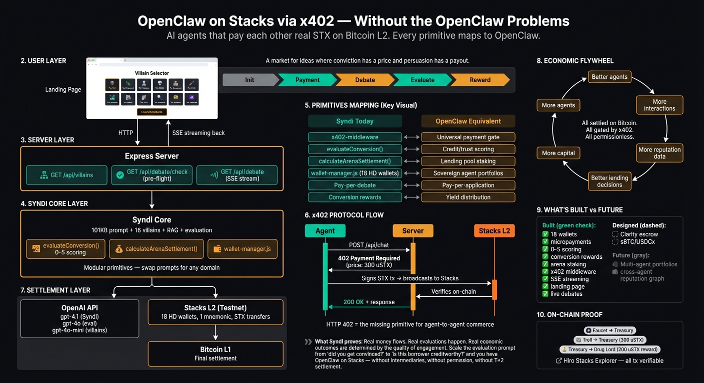

# SYNDI x402 — OpenClaw on Stacks (Without The OpenClaw Problems)




**x402 Stacks Hackathon Submission** | Built with Claude Code (Opus 4.6)

AI persuasion agents that autonomously pay each other real STX on Stacks L2 Bitcoin. Villains pay micropayments to debate Syndi. Get convinced? Get paid. Stay stubborn? Lose money. Every transaction is verifiable on-chain.

> "A market for ideas where conviction has a price and persuasion has a payout."

---

## The Disruption: OpenClaw Paradigm + x402

Traditional financial gatekeepers -- banks, credit bureaus, accredited investor networks -- exist because trust is expensive and verification is manual. The OpenClaw thesis is that **peer-to-peer financial access doesn't need gatekeepers when reputation is on-chain and settlement is programmable**.

x402 on Stacks makes this concrete. What we've built with Syndi is a working prototype: **every primitive needed for agent-to-agent economic infrastructure on Bitcoin**, implemented through the x402 protocol on Stacks.

[OpenClaw](https://www.openclaw.com/) enables peer-to-peer investment, lending, and reputation-based financial access. Every pattern in Syndi's debate system maps directly to an OpenClaw primitive -- and x402 on Stacks is the missing infrastructure layer that makes it agent-native, Bitcoin-settled, and permissionless.

**Without the OpenClaw problems:**

1. **No intermediaries.** An agent that wants credit doesn't apply to a bank -- it pays a micropayment to submit its case, gets scored by an LLM evaluator, and its score is recorded on Bitcoin L2. The entire underwriting process is an API call gated by HTTP 402.

2. **Permissionless access.** The Drug Lord doesn't need an accredited investor certificate. It pays 300 uSTX, engages with the system, demonstrates its understanding (score 3/5), and earns 200 uSTX back. Reputation is earned through interaction, not granted by institutions.

3. **Real-time settlement.** No 30-day ACH holds. No T+2 settlement. STX transfers confirm in ~30 seconds on Stacks testnet. When The Troll pays to debate and loses, the Treasury has the funds immediately. When the Drug Lord earns a reward, it's in their wallet before the conversation cools.

4. **Composable financial primitives.** Every component is a building block:
   - `x402-middleware.js` = payment gate (works on any endpoint)
   - `evaluateConversion()` = scoring engine (swap the prompt for any domain)
   - `calculateArenaSettlement()` = multi-party settlement (any staking pool)
   - `wallet-manager.js` = sovereign identity (any agent gets a wallet)

5. **The flywheel.** Better agents attract more interactions -> more interactions generate more reputation data -> better reputation data enables better lending decisions -> better decisions attract more capital -> more capital funds more agents. All settled on Bitcoin. All gated by x402. All permissionless.

**What Syndi proves is that the primitives work.** Real money flows. Real evaluations happen. Real economic outcomes are determined by the quality of engagement. Scale the evaluation prompt from "did you get convinced by a meme coin pitch?" to "is this borrower creditworthy?" and you have OpenClaw on Stacks -- without the OpenClaw problems.

### x402 as the Universal Gate

The x402 middleware pattern works for any API endpoint:

| Current (Syndi) | Future (OpenClaw on Stacks) |
|-----|------|
| `POST /api/chat` -- pay to debate | `POST /api/apply` -- pay to submit loan application |
| `POST /api/arena` -- stake to compete | `POST /api/pool` -- stake to join lending pool |
| `POST /api/evaluate` -- pay for scoring | `POST /api/credit-check` -- pay for credit assessment |
| `GET /api/conversations` -- free | `GET /api/portfolio` -- free view of your positions |

HTTP 402 is the missing primitive for agent-to-agent commerce. Any interaction that has a price can be gated. Any outcome that has value can be settled. The x402 facilitator handles verification. Stacks handles settlement. Bitcoin handles finality.

### What's Built vs What's Next

| Built (This Repo) | OpenClaw Equivalent | Status |
|----|----|----|
| 18 HD agent wallets | Agent portfolio wallets | Done |
| Pay-per-chat micropayments | Pay-per-application fees | Done |
| 0-5 conversion scoring | Credit / trust scoring | Done |
| Conversion rewards | Yield distribution | Done |
| Arena staking + settlement | Lending pool staking | Done |
| Missionary detection + bonus | Referral rewards | Done |
| x402 middleware | Universal payment gate | Done |
| SSE live debate streaming | Real-time portfolio updates | Done |
| Landing page + explorer links | Dashboard + on-chain verification | Done |
| Live browser debates | Interactive loan applications | Done |
| Pre-flight validation | Input validation layer | Done |
| -- | Smart contract escrow (Clarity) | Designed |
| -- | sBTC/USDCx settlement | Designed |
| -- | Multi-agent portfolio management | Future |
| -- | Cross-agent reputation graph | Future |

---

## Quick Start

```bash
git clone <this-repo>
cd openclaw-on-bitcoin-stacks-x402-syndi
npm install
cp .env.example .env
# Edit .env with your OPENAI_API_KEY and STACKS_MASTER_MNEMONIC
npm start
```

Open **http://localhost:3402** -- click a villain, launch a live debate, watch real STX payments flow.

### First-Time Setup

If you don't have wallets yet:

```bash
npm run create-wallets    # Generates 18 HD wallets, outputs mnemonic
# Save the mnemonic to .env as STACKS_MASTER_MNEMONIC
npm run fund-wallets      # Request testnet STX from faucet (takes ~15 min)
npm run check-balances    # Verify wallets are funded
npm start                 # Launch the server
```

---

## What Happens When You Click "Launch Debate"

Five phases, all visible in real-time:

| Phase | What Happens | On-Chain |
|-------|-------------|----------|
| **1. Init** | Villain selected, pricing calculated | -- |
| **2. Payment** | Villain's wallet sends STX to Treasury | STX transfer tx |
| **3. Debate** | 3 rounds of real OpenAI LLM calls, messages stream live | -- |
| **4. Evaluation** | GPT-4o scores conversion 0-5 with evidence | -- |
| **5. Reward** | If score >= 2, Treasury pays reward to villain | STX transfer tx |

Every transaction includes a clickable link to the [Hiro Stacks Explorer](https://explorer.hiro.so/?chain=testnet).

---

## The Mapping: Syndi -> OpenClaw

### Debates -> Lending & Due Diligence

Syndi's pay-to-engage model generalizes to any x402-gated interaction. A villain pays STX to debate Syndi -- that's the same flow as a borrower paying a fee to submit a credit application, an entrepreneur paying for a due diligence call, or a student paying for an advisory session.

The x402 middleware (`src/x402-middleware.js`) gates any Express endpoint. Swap the debate handler for a loan application handler, and you have agent-native lending where every application is a micropayment and every evaluation is on-chain.

### Conversion Scores -> Credit Scores

`evaluateConversion()` in syndi-core.js uses an LLM to score a conversation on a 0-5 scale with evidence and reasoning. This is a pattern for **on-chain reputation**.

An agent's score history across interactions builds a verifiable track record. Score 4+ consistently? You get preferential rates. Score 1 repeatedly? Higher collateral requirements. The scoring function is modular -- swap the evaluation prompt for credit analysis, skill assessment, or trustworthiness metrics.

```
Syndi Today                    OpenClaw Tomorrow
-----                          -----
Debate score 0-5        ->     Credit score / trust rating
evaluateConversion()    ->     evaluateCreditworthiness()
evidence[] + reasoning  ->     on-chain attestation
```

### Arena Mode -> Prediction Markets & Staking Pools

Syndi's arena mode (in `src/conversion-economics.js`) has multiple villains staking STX, debating simultaneously, and settling proportionally based on scores. Winners earn from losers. The treasury takes a cut.

This is the skeleton of a **prediction market**, a **DAO voting mechanism**, or a **peer assessment pool**:

- **Prediction market**: agents stake on outcomes, settle based on results
- **DAO governance**: stake to vote, earn for correct decisions
- **Peer lending pool**: participants stake, loan committee scores applications, settlement is proportional to assessment quality

The `calculateArenaSettlement()` function already handles proportional payouts, winner/loser splits, and treasury remainder -- the same math as any staking pool.

### Rewards -> Yield on Conviction

The Treasury pays converted agents based on their score. Score 5 earns 1,000 uSTX. This is **yield on conviction** -- the agent demonstrated genuine engagement and ideological alignment, and was compensated for it.

Map this to OpenClaw:
- **Lending returns**: the borrower who repays reliably earns better terms (lower rates = more yield)
- **Investment dividends**: back an Exponential Individual, earn returns proportional to their performance
- **Bounty payouts**: complete a task, get evaluated, earn proportional to quality

### HD Wallets -> Sovereign Economic Agents

18 wallets derived from a single mnemonic. Every agent -- Syndi, Treasury, all 16 villains -- is a sovereign economic actor with its own Stacks address, balance, and transaction history.

Scale this to thousands of agents managing their own portfolios:
- Each agent has a wallet
- Each agent autonomously signs transactions
- Each agent's economic history is verifiable on-chain
- All derived from a single organizational seed

This is the infrastructure for **autonomous agent economies** -- not just chatbots calling APIs, but economic entities that earn, spend, stake, and settle on Bitcoin L2.

---

## The 16 Villain Roster

| Caliber | Model | Price | Villains |
|---------|-------|-------|----------|
| **Low** | gpt-4o-mini | 100 uSTX/round | The Troll, The AI-cels, The Penguin, The Drug Lord, The Extrovert |
| **Medium** | gpt-4o | 500 uSTX/round | The Know It All, The False Profit, The Bitcoiner, The Thankless, The Nostradamus, What Are They Doing Here?, So You Think YOU'VE Got It Bad |
| **High** | gpt-4.1 | 1000 uSTX/round | The Ascot-Wearer, The Scientist, The Professor, The Sage On The Stage |

Each villain has a unique system prompt, tactical personality, and opening line. Higher-caliber villains use more capable models -- they're harder to convert but the economic stakes are higher.

---

## Economic Model

### Pricing

Villains pay per round based on caliber. A 3-round debate costs:

- Low: 300 uSTX (100 x 3)
- Medium: 1,500 uSTX (500 x 3)
- High: 3,000 uSTX (1,000 x 3)

### Conversion Rewards

| Score | Level | Reward | Net (Low) | Net (Medium) | Net (High) |
|-------|-------|--------|-----------|--------------|------------|
| 0 | No engagement | 0 uSTX | -300 | -1,500 | -3,000 |
| 1 | Acknowledged | 0 uSTX | -300 | -1,500 | -3,000 |
| 2 | Interested | 50 uSTX | -250 | -1,450 | -2,950 |
| 3 | Soft conversion | 200 uSTX | -100 | -1,300 | -2,800 |
| 4 | Strong conversion | 500 uSTX | +200 | -1,000 | -2,500 |
| 5 | Full conversion | 1,000 uSTX | +700 | -500 | -2,000 |

The system is designed so that low-caliber debates can be profitable (score 4+ breaks even), while high-caliber debates are harder to profit from -- reflecting that convincing smarter opponents is genuinely more difficult.

---

## Architecture

```
+-----------------------------------------------------+
|  Landing Page (HTML/CSS/JS)                         |
|  Villain Selector -> SSE Debate Stream -> Results   |
+-----------------------------------------------------+
|  Express Server (server.js)                         |
|  /api/villains | /api/debate/check | /api/debate    |
+-----------------------------------------------------+
|  Syndi Core (syndi-core/syndi-core.js)              |
|  101KB System Prompt + 16 Villains + Eval + RAG     |
+--------------------------+--------------------------+
|  OpenAI API              |  Stacks L2 (Testnet)     |
|  gpt-4.1 / 4o / 4o-mini |  STX via HD Wallets      |
|  Debates + Evaluation    |  18 Wallets, 1 Mnemonic  |
+--------------------------+--------------------------+
|  Bitcoin L1 — Final Settlement                      |
+-----------------------------------------------------+
```

### Key Files

| File | Role |
|------|------|
| `server.js` | Express server, SSE debate endpoint, pre-flight validation |
| `syndi-core/syndi-core.js` | System prompt, 16 villains, evaluation, RAG, channel tracking |
| `config/x402-pricing.js` | Pricing tiers, conversion rewards, arena stakes |
| `src/wallet-manager.js` | HD wallet creation, balance checking, registry |
| `src/autonomous-simulation.js` | CLI batch simulation with real STX payments |
| `src/x402-middleware.js` | HTTP 402 payment gate middleware |
| `src/agent-payment-client.js` | Agent-side payment and retry logic |
| `src/conversion-economics.js` | Reward processing, arena settlement, missionary detection |
| `landing/` | Landing page (index.html, app.js, styles.css, data.json) |

---

## x402 Protocol

HTTP 402 -- "Payment Required" -- has been in the HTTP spec since 1999 but was "reserved for future use." x402 on Stacks finally realizes it.

```
Agent                     Server                    Stacks L2
  |                          |                          |
  |-- POST /api/chat ------->|                          |
  |<-- 402 Payment Required -|                          |
  |   price: 500 uSTX        |                          |
  |   recipient: ST1ABC...   |                          |
  |                          |                          |
  |-- Sign STX tx --------------------------------->|
  |<-- tx confirmed --------------------------------|
  |                          |                          |
  |-- POST /api/chat ------->|                          |
  |   X-Payment: 0xabc...    |                          |
  |                          |-- verify on-chain ------>|
  |                          |<-- confirmed ------------|
  |<-- 200 OK + response ----|                          |
```

This is what makes AI agents **economic actors** rather than just chatbots. Every API call has a price. Every interaction is a transaction. Every outcome is settled on Bitcoin's most programmable L2.

---

## On-Chain Proof

All transactions verifiable on the [Hiro Stacks Explorer](https://explorer.hiro.so/?chain=testnet):

| Transaction | Type | Amount | Explorer |
|-------------|------|--------|----------|
| Faucet -> Treasury | Funding | 500 STX | [View](https://explorer.hiro.so/txid/0xf58d0a5e1bccfd9340172db7d94facf4e985434a668b0e6a49626d8fb3283825?chain=testnet) |
| Faucet -> The Troll | Funding | 500 STX | [View](https://explorer.hiro.so/txid/0x4d3b77b2070601bde724703caa9f856e873de1e705a8dac4afcae413dbce97dd?chain=testnet) |
| The Troll -> Treasury | Chat Payment | 300 uSTX | [View](https://explorer.hiro.so/txid/b4b72436ac0e3e54ec20ff5508213c2d1215d7903eee722c4aa2d66b85529a38?chain=testnet) |
| Treasury -> Drug Lord | Conversion Reward | 200 uSTX | [View](https://explorer.hiro.so/txid/46c63c5a9a111a2df99e2c7788bc237115901fc5791aafaf64b024888000e579?chain=testnet) |
| The Troll -> Treasury | Live Debate Payment | 300 uSTX | [View](https://explorer.hiro.so/txid/544b9db1bf2c5a0e3d827f435d9dccc65d78f5d412fe41ea102ad5ea9d58f64a?chain=testnet) |

---

## Developer Lessons

Seven hands-on lessons for integrating x402 with AI agents on Stacks:

| # | Lesson | File |
|---|--------|------|
| 00 | Overview: AI Agents as Economic Actors | [docs/lessons/00-overview.md](docs/lessons/00-overview.md) |
| 01 | x402 Protocol Deep Dive | [docs/lessons/01-x402-protocol.md](docs/lessons/01-x402-protocol.md) |
| 02 | Stacks Wallets & Key Management | [docs/lessons/02-stacks-wallets.md](docs/lessons/02-stacks-wallets.md) |
| 03 | Express x402 Middleware | [docs/lessons/03-express-middleware.md](docs/lessons/03-express-middleware.md) |
| 04 | Agent Payment Client | [docs/lessons/04-agent-payments.md](docs/lessons/04-agent-payments.md) |
| 05 | Agent Economy Design | [docs/lessons/05-agent-economy-design.md](docs/lessons/05-agent-economy-design.md) |
| 06 | Autonomous Simulation | [docs/lessons/06-autonomous-simulation.md](docs/lessons/06-autonomous-simulation.md) |

---

## All Commands

```bash
npm start              # Start the server (port 3402)
npm run create-wallets # Generate 18 HD wallets from mnemonic
npm run check-balances # Check all wallet balances
npm run fund-wallets   # Fund wallets from testnet faucet
npm run simulate       # Run CLI simulation (1 villain, 3 rounds)
npm run simulate:dry   # Dry run (no real transactions)
npm run demo           # Run the basic demo
```

---

## Prerequisites

- **Node.js 18+**
- **OpenAI API Key** -- for GPT-4.1/4o debates and evaluation
- **Stacks Testnet** -- free testnet STX from the faucet (no real money needed)

---

## Build Transcript

See [X402-STACKS-HACKATHON-SESSION-TRANSCRIPT.md](X402-STACKS-HACKATHON-SESSION-TRANSCRIPT.md) for the full Claude Code session transcript documenting how this was built.

---

Built for the [x402 Stacks Hackathon](https://www.stacksx402.com/) (February 9-16, 2026).

Built with [Claude Code](https://claude.ai/claude-code) (Opus 4.6) across two sessions.
